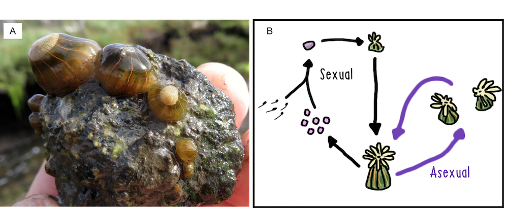
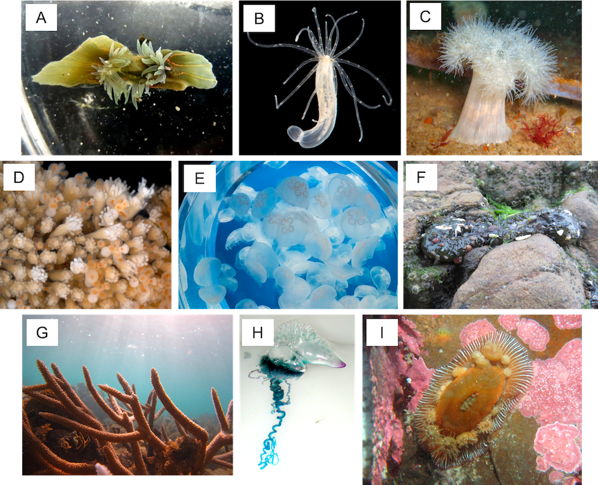
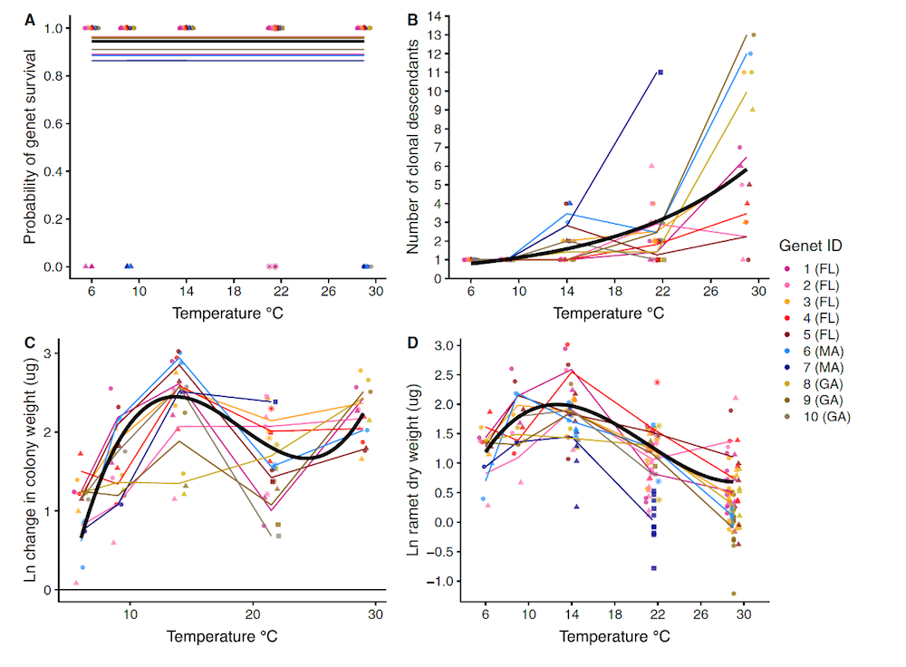
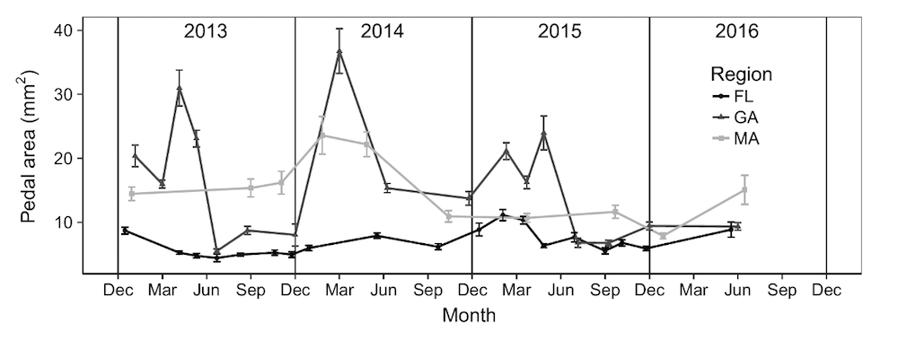
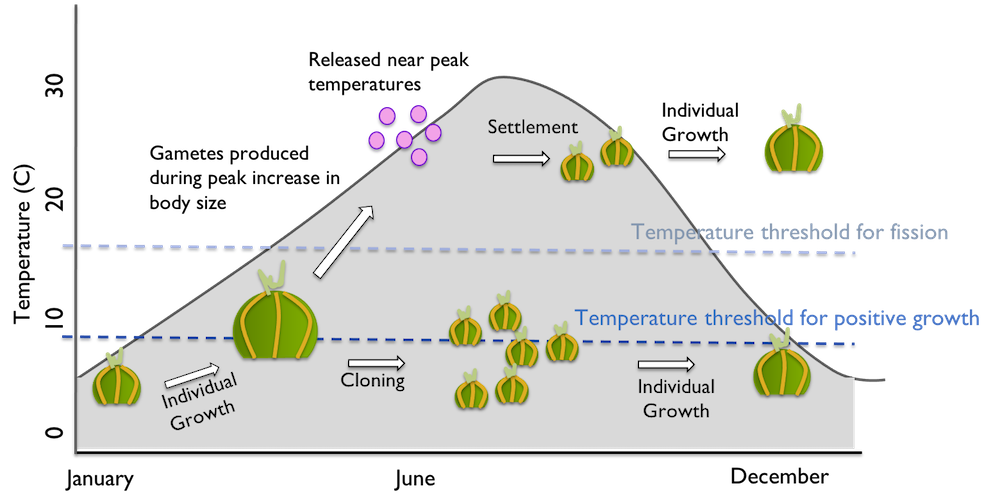
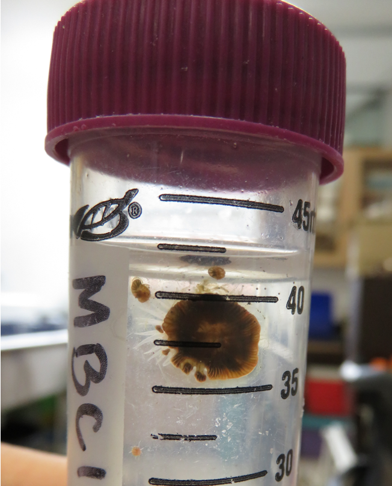

Dr. Will H. Ryan

University of Alabama at Birmingham

Life is full of difficult questions: What should I eat for dinner? Where should I live? Should I have kids? 

It is no different for clonal cnidarians, who can add: Should I rip myself in half? Should I leave a trail of lacerated tissue behind and hope for the best? If yes, when should I split myself to maximize my fitness? The answer to all of these questions, of course, as so often happens in ecology, is “it depends”. 

I have spent the better part of the fourteen years trying to come up with a more satisfying answer by studying the factors driving life cycle diversity in clonal cnidarians. First as a student working on colony form plasticity in an encrusting hydrozoan (BS and MS, [Dudgeon Lab, CSUN](http://www.csun.edu/~sd51881/)), then as a doctoral student working on intraspecific variation in clonality in the invasive sea anemone *Diadumene lineata* ([Miller Lab, FSU](https://www.bio.fsu.edu/~miller/HOMEPAGE/)) (Figure 1), and now as a postdoc continuing work in the same system ([Krueger-Hadfield Lab, UAB](https://www.quooddy.com/)). The slightly more satisfying answer for all of the above questions is that it depends on both your genotype and your environment. But, we will get to that in a minute.

 **Figure 1** (A) *Diadumene* *lineata* in Elkhorn Slough, California. (B) The partially clonal life cycle of *D. lineata* involves gamete production and fission. Photo & diagram: Will Ryan, CC BY-SA  

### Why Cnidarians?

Cnidarians (sea anemones, corals, jellyfish, etc.) have fantastically weird reproductive habits. They are the masters of casually blending asexual and sexual reproduction in every conceivable way (Fautin 2002). For asexual reproduction, some rip themselves in half longitudinally (*D. lineata*, Figure 2A), while others can grow a mirror image twin before breaking apart at the foot (*Nematostella vectensis*, Figure 2B). Some cast off bits of tissue that can become new polyps scattered across the rocks (*Metridium sp.*, Figure 2C) or sprout vascular runners that bud new polyps like a grove of Quaking Aspens (*Hydractinia symbiolongicarpus,* Figure 2D). Jellyfish famously divide by strobilation, sending off Frisbee-disk clones (*Aurelia aurita*, Figure 2E). Still others layer on additional complexity, congregating polyps in colonial arrangements ranging from loose associations (*Anthopleura elegantissima,* Figure 2F,*)* to characteristic three-dimensional forms (*Acropora cervicornis*, Figure 2G), to highly integrated and specialized superstructures (*Physalia physalias*, Figure 2H).

 **Figure 2** Examples of Cnidarian diversity. (A) *Diadumene lineata*, the orange-lined anemone, undergoing binary fission, (B) *Nematostella vectensis*, the starlet anemone, (C) *Metridium sp*., the plumose anemone, (D) *Hydractinia symbiolongicarpus*, Snail fur, (E) *Aurelia aurita*, the moon jelly, (F) *Anthopluera elegantissima*, the aggregating anemone, undergoing binary fission, (G) *Acropora cervicornis*, staghorn coral, (H) *Physalia* *physalias*, the Portuguese man o’war, and (I) *Epiactis* *prolifera*, the proliferating anemone, brooding offspring. See below for photo credits. 

 Cnidarians are rarely, if ever, exclusively asexual and their sexual diversity is no less astounding. There are gonochores and all manner of hermaphrodites. Some are broadcaster spawners, while others brood. Some provision long-dispersing larvae, while others dribble out crawling planula. Some move around throughout their life (e.g., *Stomphia* *coccinea*, the swimming anemone). Others stay closer to home. In one extreme example of homebody-ism, the brooding anemone *Epiactis prolifera*, keeps its young cluster along its column (Figure 2I) leading to extremely high rates of inbreeding (Edmands and Potts 1997). Importantly, many of these life cycle features vary among individuals, suggesting even greater diversity.

Trying to describe and explain the causes of such diversity has been an enthusiastic pursuit for generations of biologists. However, this quest is more than just a naturalist’s avocation. Exploring the wealth of strategies found within and among species causes us to rethink our assumptions about animal reproduction (e.g., inbreeding is rare in the sea and only occurs in hermaphrodites; see Olsen et al. 2020) and pushes us to develop theoretical and analytical tools that can better accommodate the whole of nature (e.g., population genetic tools for clonal organisms; see Arnaud-Haond et al. 2007). After all, any theory of life cycle evolution that can accommodate everything from the parasitic Myxozoans, to the chimeric hydroid *Ectopleura larynx* (Chang et al. 2018), to the wandering solitary coral *Fungia fungites* is bound to teach us something valuable about the universal rules of life. 

### What I've learned

For the last several years, my particular fascination has been with the role of seasonal and latitudinal temperature gradients in structuring the reproductive habits of the widespread anemone *D. lineata.* This intertidal species originated in East Asia and has spread to temperate bays and harbors around the world over the last 150 years. In the process, it has encountered a wide variety of thermal regimes, including the hot and seasonally dynamic Gulf of Mexico all the way to the cool, stable waters of Southeastern Alaska. Thus, understanding how temperature influences growth and reproduction is likely important for predicting the success of this species. It also provides a glimpse of the forces that govern life cycle evolution in dynamic environments. 

Through a combination of field observations and common garden experiments, my collaborators and I have been piecing together the story of how temperature variation in time and space structures investment in asexual and sexual reproduction. Temperature-dependent fission allows this species to rapidly reduce its body size as the environment heats up (Ryan 2018). Transitioning from producing one large individual to many small individuals as the temperature rises causes an increase in the surface area to mass ratio of the colony. This trick may help the individuals continue to meet their oxygen needs as metabolic rates go up and dissolved oxygen availability goes down in warming water. It also allows colonies of sea anemones to maintain similar biomass accumulation rates over an astonishingly large temperature range (~14 – 29° C) (Ryan et al. 2019) (Figure 3). 

 **Figure 3** Patterns of (A) survival, (B) fission, (C) colony biomass accumulation, and (D) individual anemone size produced by clonal replicates of ten genets (lines/colors) of *D. lineata* over 12 weeks in common garden temperature treatments. Temperature increases fission and decreases individual body size. But, colony weight gain can be similar at intermediate and high temperatures. Adapted from Ryan et al. 2019, *Marine Biology* 166:157. 

 

Being able to track an energetically optimal body size through the year seems like a major advantage in places with large seasonal swings in temperature, as occurs in the native Japanese range and along the Atlantic Coast of North America. But, how does this affect gamete production? Toward the middle of the species range, the peak fission rate and smallest body size correspond with the end of summer, where dissolved oxygen is least available (Figure 4). 

 **Figure 4** Mean +/- SE anemone body size over 3.5 years at sites in Florida (FL), Georgia, (GA) and Massachusetts (MA). Individuals in Georgia show a characteristic alternation between large bodied and small bodied correlated with peak gametogenesis and fission, respectively. From Ryan 2018 *The* *American Naturalist* 191(2): 210– 219. 

Gametogenesis, on the other hand, coincides with cool spring temperatures and culminates with fertile gametes produced when individual body size is the largest (Ryan and Miller 2019, Ryan *unpublished data*). The pattern that emerges when we map the life cycle onto the seasonal cycle (Figure 5) is that temperature helps structure a sequential expression of reproductive mode – sexual followed by asexual. This seems to allow genets to take advantage of large bodies for gamete production in the spring followed by small bodies to survive respiration-limiting conditions in the summer.

 **Figure 5** Mapping life cycle onto a Mid-Atlantic seasonal water temperature cycle (grey area) reveals the role of seasonal temperature change in structuring the timing of sexual and asexual reproduction. Individual growth is maximized through the winter and spring. Rapid fission reduces individual body size during the heat of the summer. 

The expression of temperature-dependent plasticity has consequences for among population variance too. In warmer regions, the balance is skewed toward longer periods of clonal reproduction with fewer individuals being large enough to make gametes. In cooler places, fission rates are low and gametogenesis appears to take longer, thus fluctuations in body size do not correspond as tightly with gamete production. Interestingly, there is co-gradient variation among populations on the Atlantic coast in the sensitivity of fission rate to temperature (Ryan 2018). That is, anemones from the Gulf of Mexico divide more frequently at all temperatures than those from Georgia or Massachusetts. This pattern is congruent with high summer temperature imposing strong selection on individual body size, which may drive fission rate evolution. However, there is more work need to test this hypothesis. 

### What we are learning now

Based on the story we've pieced together so far, we have been able to make and test predictions about how variation in clonal investment influences population genetic structure (Ryan, Aida, Krueger-Hadfield, *in review*) and demographic patterns (Ryan and Krueger-Hadfield, *unpublished data*). We have also constructed new hypotheses about the trajectory of life cycle evolution through the invasion and as these species moved into less seasonally variable climates (i.e., the Pacific Coast of the North America and Europe; Ryan and Krueger-Hadfield, *unpublished data*). We haven’t even begun to deal with the fact that this species also engages in pedal laceration! This alternate form of asexual reproduction is commonly found in native Japanese populations (Atoda 1973) (Figure 6) but has been curiously rare in the non-native populations that have been cultured. Clearly, there is plenty of work left to do.  

 **Figure 6** Pedal lacerates produced by a *D. lineata* individual collected in Kanagawa, Japan. Photo: Will Ryan, CC BY-SA 

### In Summary

Cnidarians, with their seemingly simple construction and endless variation, can easily lure the unwary naturalist into a lifetime of grappling with unanticipated complexity. For many species, we are still hampered by uncertain taxonomy (cnidarian systematics is not for the faint of heart!) and understudied natural history. It is clear, however, that there is much to learn about how and why certain life cycles and reproductive strategies evolve by grappling with the variation within and among these species. With an ever-expanding toolkit assembled from life history theory, demography, physiological ecology, and population genetics we have been able to mine some of the intellectual gold that was always promised in these hills. Hopefully, we will continue to turn up answers to some of life’s most persistent (life cycle evolution) questions.

 Now though, what *should* I eat for dinner?  

### Biography

 [Will Ryan](www.willhryan.com) is an IRACDA-MERIT Postdoctoral Scholar at the University of Alabama at Birmingham. He studies the evolution of complex life cycles in marine invertebrates and algae. 

### Works Cited

Arnaud-Haond, S., C. M. Duarte, F. Alberto, and E. A. Serrão. 2007. Standardizing Methods to Address Clonality in Population Studies. *Molecular Ecology*. 

Atoda, Kenji. 1973. Pedal laceration of the sea anemone, *Haliplanella luciae*. Publications of the Seto Marine Biological Laboratory 20: 299-313. 

Chang, E. Sally, Maria E. Orive, and Paulyn Cartwright. 2018. Nonclonal Coloniality: Genetically Chimeric Colonies through Fusion of Sexually Produced Polyps in the Hydrozoan *Ectopleura Larynx*. *Evolution Letters* 2 (4): 442–55. 

Edmands, S., and D. C. Potts. 1997. Population Genetic Structure in Brooding Sea Anemones (Epiactis Spp.) with Contrasting Reproductive Modes. *Marine Biology* 127 (3): 485–98. 

Fautin, Daphne Gail. 2002. Reproduction of Cnidaria. *Canadian Journal of Zoology* 80 (10): 1735–54. 

Minasian, Leo L. 1982. The Relationship of Size and Biomass to Fission Rate in a Clone of the Sea Anemone, Haliplanella Luciae (Verrill). *Journal of Experimental Marine Biology and Ecology* 58 (2–3): 151–62. 

Olsen, Kevin C., Will H. Ryan, Alice A. Winn, Ellen T. Kosman, Jose A. Moscoso, Stacy A. Krueger‐Hadfield, Scott C. Burgess, Dave B. Carlon, Richard K. Grosberg, Susan Kalisz, Don R. Levitan. Inbreeding Shapes the Evolution of Marine Invertebrates. *Evolution* 74 (5): 871–82. 

Ryan, Will H. 2018. Temperature-Dependent Growth and Fission Rate Plasticity Drive Seasonal and Geographic Changes in Body Size in a Clonal Sea Anemone. *The American Naturalist* 191 (2): 210–19.

Ryan, Will H., Leoni Adams, Guido Bonthond, Nova Mieszkowska, Kathryn E. Pack, and Stacy A. Krueger-Hadfield. 2019. “Environmental Regulation of Individual Body Size Contributes to Geographic Variation in Clonal Life Cycle Expression.” *Marine Biology* 166 (12).

Ryan, Will H., and Thomas E. Miller. 2019. Reproductive Strategy Changes across Latitude in a Clonal Sea Anemone.” *Marine Ecology Progress Series*. 611: 129 – 141.

### Photo credits

Figure 2:

A: *Diadumene lineata:* Will H. Ryan, CC BY-SA

B: *Nematostella* *vectensis*: Smithsonian Environmental Research Center, CC BY, https://commons.wikimedia.org/w/index.php?curid=76840036

C: *Metridium* *sp.:* Tim Sheerman-Chase, CC BY, https://commons.wikimedia.org/w/index.php?curid=47731806

D: *Hydractinia* *symbiolongicarpus*: Eric A. Lazo-Wasem - CC, https://commons.wikimedia.org/w/index.php?curid=81749998

E: *Aurelia* *aurita*: Σ64, CC BY, https://commons.wikimedia.org/w/index.php?curid=69418720

F: *Anthopleura* *elegantissima*: Will H. Ryan, CC BY-SA

G: *Acropora* *cervicornis*: Roban Kramer, CC BY-SA, https://commons.wikimedia.org/w/index.php?curid=52345483

H: *Physalia* *physalias*: Image courtesy of Islands in the, Public Domain, https://commons.wikimedia.org/w/index.php?curid=185562

I: *Epiatcis* *prolifera*: Brocken Inaglory, CC BY-SA, https://commons.wikimedia.org/w/index.php?curid=3419853
